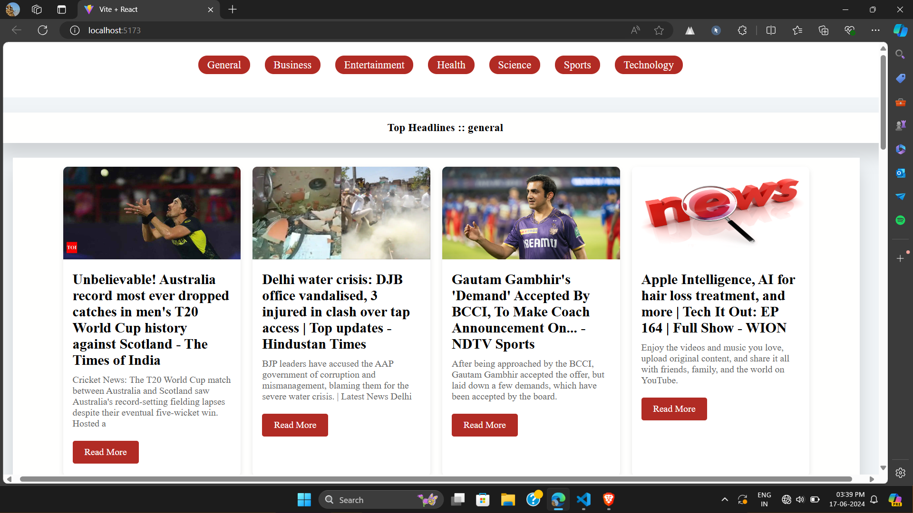

# create your news api  from    https://newsapi.org/  then create account and get your own api - harshit gupta
<h3>set your api key in env file or  for directly set got ot  src/component/newsapi.jsx then replace api key </h3> 
<h3>And  also add Dependency - npm i</h3> 

